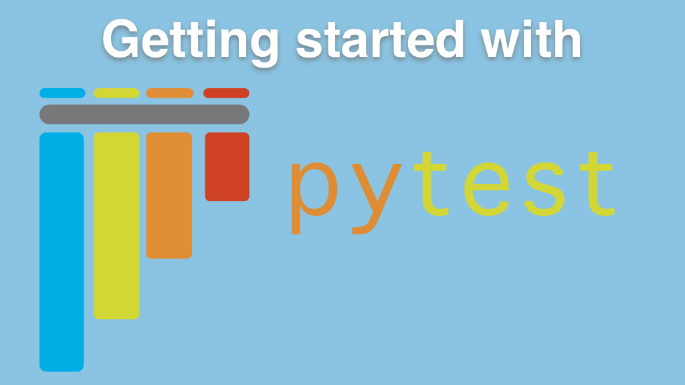

# Getting started with pytest course

Course materials and handouts for **[Getting started with pytest](https://talkpython.fm/pytest)** course.

This course teaches you to effectively use Python's most popular and powerful test framework, pytest. pytest is partly so widely used because it's so fast to get started. However, many people stop with the basics and never learn pytest's true power.

In [**Getting started with pytest**,](https://talkpython.fm/pytest) you'll do so much more than just get started. You'll learn the five super powers of pytest: simple test functions, fixtures, parametrization, markers, and plugins. With this knowledge, you'll be able to test more effectively and efficiently, whenever you need to write software tests.

## What will you learn?

In this course, you will:

- Build clean, readable, **well structured test functions**
- Utilize **fixtures** to hold **setup, teardown, and test data**
- Share fixtures between tests and between test files
- **Trace test execution** through tests and fixtures to help debug tests
- Use **test parametrization** to create reams of test cases with a small number of test functions
- Identify test parametrizations cleanly with **test ids**
- Learn to **skip tests** with markers
- Run subsets of tests using **keywords**, **markers**, **test classes**, and combinations of these techniques
- Expand pytest functionality with **pytest plugins**
- And lots more
- View the full [**course outline**](https://training.talkpython.fm/courses/getting-started-with-testing-in-python-using-pytest#course_outline)

## Who is this course for?

This course is for anyone who needs to test Python code, or anything reachable via Python code. Yep, pytest is being used to test APIs, web services, embedded systems, hardware, and of course Python packages, applications, and utilities.

Since many people are writing test code alongside their other work, the techniques presented in this course are focused on those that help you be efficient and effective with pytest.

Of course you can use these techniques if you are spending most of your time writing tests.

This course will be useful for software engineers of all flavors, including test engineers.

As for prerequisites, we assume:

- *No software testing experience* required
- Familiarity with Python would be helpful

## Get better at pytest

pytest has become the defacto way we test Python software. If you are not up to speed with pytest and clean test practices, you'll be at a disadvantage. This course is focused on using the best techniques to provide a deep and meaningful understanding of software testing with pytest. **[Take the course](https://talkpython.fm/pytest), level up your productivity today**.
